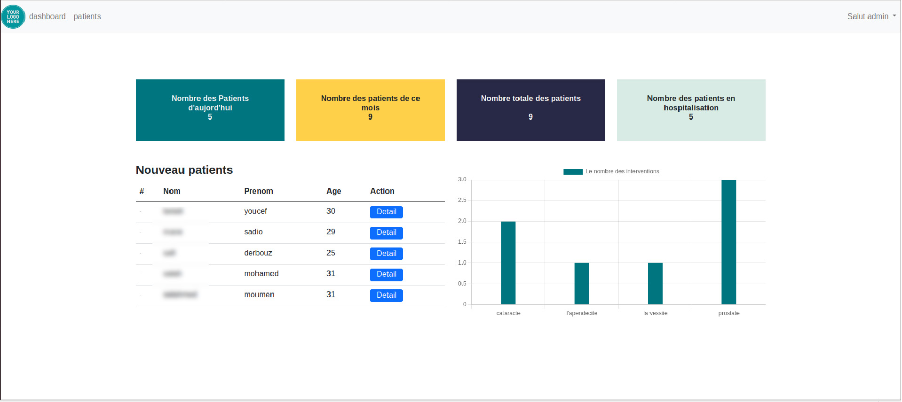

# Software designed for clinical to manage and organise their services

## Build with
- Flask/jinja
- Python
- HTML/css -SQL Alchemy

## Prerequisites
- Python
- Pip
- flask
For more information visit this Link : https://flask.palletsprojects.com/en/2.0.x/installation/
## Local Development
- Open the terminal and start a server with 'python app.py'
- Open http://localhost:5000 in your browser
## Usage
- Sign in username='admin', Password='admin'
- Start browsing dashboard and patients 
- Add Patients
- Add surgeries and upload checkup to each patient

## Describtion
For better management of the clinic, This software specially designed to facilitate several tasks and allow you to:

- manage patients (Adding, modifying and deleting)
- calculate the number of daily, weekly, monthly and annual patients.
- calculate the number of hospitalized patients.
- Add for each patient the assessments carried out as well as the surgical interventions.
- calculate the number of interventions and group them by type.
- print the patient's consent for each intervention.
- print the patient file.
This application should be installed on your local network as a server to which you can connect the entire network architecture of your establishment without forgetting that you can access it even in mobile .

## The Author
- GitHub: @minos95
- Twitter: @aminos_rahal
- LinkedIn: rahal sidahmed